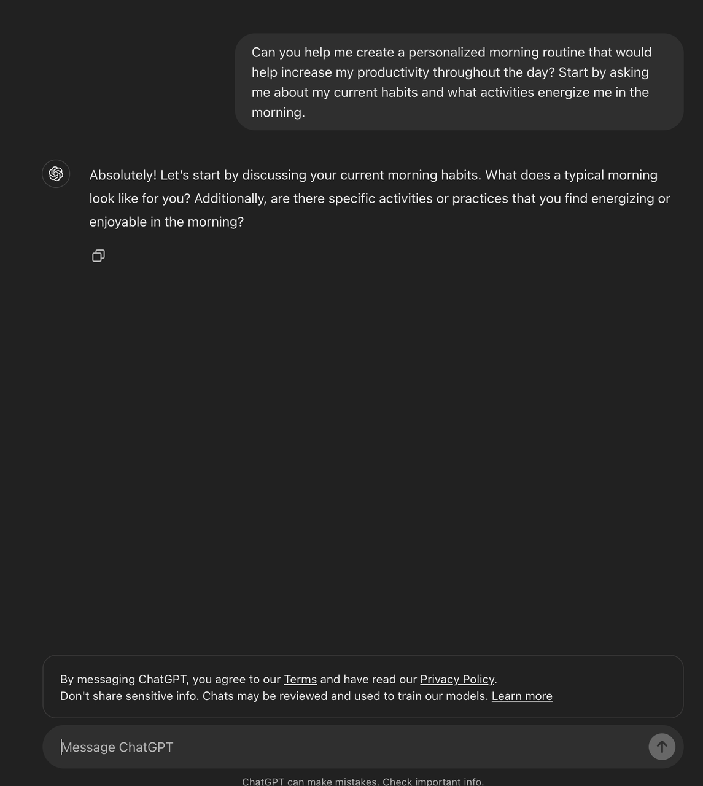
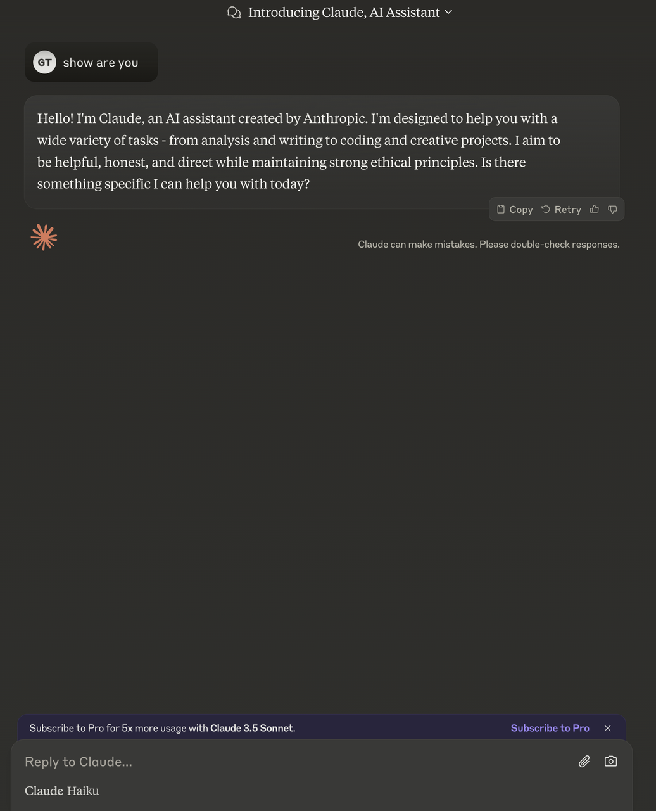

# 【前端项目一】LLM 对话框组件 2.0


## 项目介绍

这是一个支持多种输入输出形式的 LLM 对话框组件，用户可以通过发送文本、图片、PDF 等多种形式的输入，LLM 则会根据接收到的信息进行处理并返回相应的结果。该组件不仅能够接收和展示文本信息，还具备处理和显示图片、文档等多媒体内容的能力，为用户提供更加直观和便捷的交互体验。

## 功能特性

1. **多种输入支持**：

   - 文本输入
   - 图片上传
   - PDF 文件上传

2. **丰富的输出展示**：

   - 支持 Markdown 格式渲染
   - 代码块高亮显示
   - 代码复制功能
   - 流式打字效果

3. **两种交互模式**：

   - 内联对话框：可嵌入页面任意位置，支持收缩/展开/对话三种状态
   - 独立对话框：全页面对话模式

4. **用户友好设计**：
   - 响应式布局
   - 无障碍访问支持
   - 媒体文件预览

## 技术栈

- **前端框架**：React、Next.js
- **样式**：TailwindCSS
- **语言**：TypeScript
- **LLM 集成**：Coze API
- **测试**：Vitest
- **CI/CD**：GitHub Actions

## 项目结构

```
src/
├── app/                  # Next.js应用页面
│   ├── globals.css       # 全局样式
│   ├── layout.tsx        # 应用布局
│   └── page.tsx          # 主页
├── components/           # 组件
│   ├── ChatInput.tsx     # 聊天输入组件
│   ├── InlineChatBox.tsx # 内联对话框组件
│   ├── MarkdownRenderer.tsx # Markdown渲染组件
│   ├── Message.tsx       # 消息组件
│   └── StandaloneChatBox.tsx # 独立对话框组件
├── services/             # 服务
│   └── llmService.ts     # LLM API服务
├── types/                # 类型定义
│   └── chat.ts           # 聊天相关类型
├── utils/                # 工具函数
│   └── chatUtils.ts      # 聊天工具函数
└── tests/                # 测试
    └── setup.ts          # 测试设置
```

## 安装与使用

### 安装依赖

```bash
npm install
```

### 开发模式

```bash
npm run dev
```

### 构建生产版本

```bash
npm run build
npm run start
```

### 运行测试

```bash
# 运行所有测试
npm test

# 监视模式
npm run test:watch

# 测试覆盖率报告
npm run test:coverage
```

## CI/CD 流程

项目配置了完整的 CI/CD 流程：

1. **CI 流程**：

   - **代码质量检查**：

     - 代码风格检查（ESLint）
     - TypeScript 类型检查
     - 依赖项安全漏洞检查

   - **代码安全扫描**：

     - GitHub CodeQL 分析
     - Dependabot 依赖项安全更新

   - **测试**：

     - 单元测试
     - 测试覆盖率报告（目标：80%以上）

   - **构建检查**：
     - 确保项目可正常构建
     - 构建产物缓存，提高部署效率

2. **CD 流程**：
   - 主分支代码合并后自动部署到生产环境
   - 支持多环境部署（预发布和生产环境）

## 兼容性

- 支持现代浏览器
- 响应式设计，适配移动端和桌面端
- 支持 H5 和小程序形态

## 贡献指南

1. Fork 项目
2. 创建特性分支 (`git checkout -b feature/amazing-feature`)
3. 提交更改 (`git commit -m 'Add some amazing feature'`)
4. 推送到分支 (`git push origin feature/amazing-feature`)
5. 创建 Pull Request

## 许可证

MIT

## 背景

当前，与大模型的交互多种多样，但最常见也是最容易被用户理解的，就是对话框模式，例如：

- ChatGPT

  

- Claude

  

- Coze

  

这种模式下，用户可以通过发送文本、图片、PDF 等多种形式的输入，LLM 则会根据接收到的信息进行处理并返回相应的结果。为此，需要在前端页面设计和实现支持多种输入输出形式的对话框组件，该组件不仅要能够接收和展示文本信息，还需具备处理和显示图片、文档等多媒体内容等能力，以便为用户提供更加直观和便捷的交互体验。

毫不夸张的说，几乎所有 LLM 产品都会提供这类交互组件，因此非常值得学习借鉴。

## 需求

1. **组件能力**
   组件样式可自行设计，此处以 claude 为例，介绍关键特性：

   

   - 需要支持用户输入对话，且对话内容支持图片、PDF 等多媒体格式；
   - 用户输入对话并回车后，调用 LLM 接口，组件内流式展示大模型返回的结果；
   - LLM 返回内容可能为：文本、Markdown、图片等，需要正确展示这些格式内容；
   - **需要支持 LLM 流式返回结果，实现逐行打印效果；**
   - **若返回结果包含代码，请提供"Copy" 按钮，方便用户复制代码，样式如：**

     

   在此基础上，希望该组件支持内联与独立对话两种功能模式。

2. **内联对话框**
   参考 Vercel 文档站，期望该对话组件支持内联模式，该模式下存在三种状态：

   - 收缩形态：表现为一个单一的输入框，点击后展开弹框进入第二形态
     
   - 展开形态：表现为支持对话的弹框模式，形如：
     
   - 对话形态：用户输入问题后，立即进入该形态，形态上既为 LLM 对话信息流，如：
     
     注意，对话形态下需要支持 markdown、图片等格式。

3. **独立对话框**
   独立对话框模式下，页面主体内容为该对话框，对话内容平铺在页面上，大致样式如下：
   
   具体功能与页面布局可自由发挥，不做限制。
4. **兼容性**
   除 Web 端外，组件还需兼容 H5、小程序形态，并提交相关演示材料。

## 加分项

1. 单测覆盖率超过 80%；
2. 有完善的 CI 流水线，并在 CI 中执行构建、自动测试、Lint 检查、ts 检查等检测动作；
3. 有完善的 CD 流水线，实现发布动作自动化；
